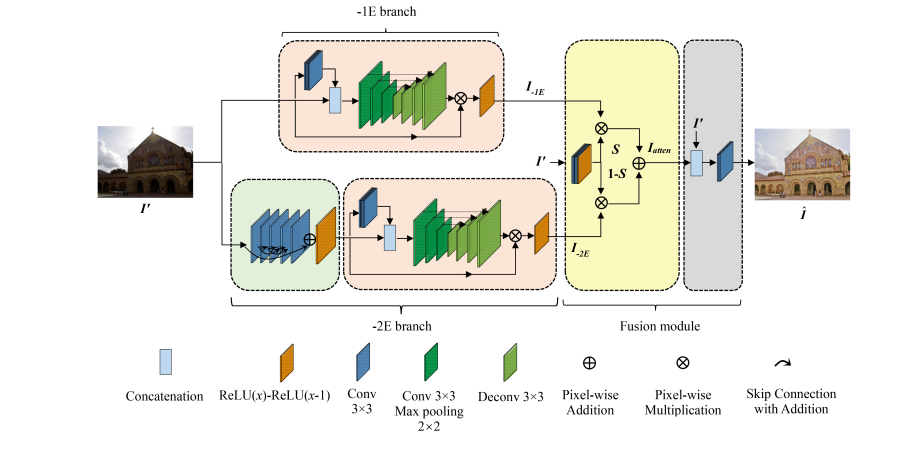
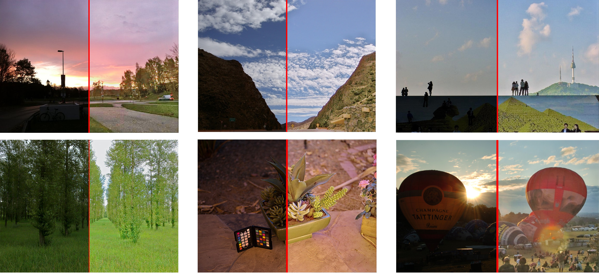
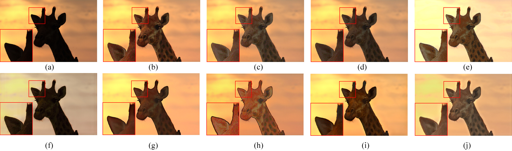
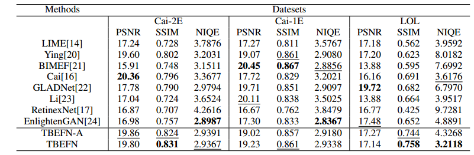
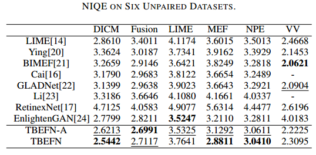
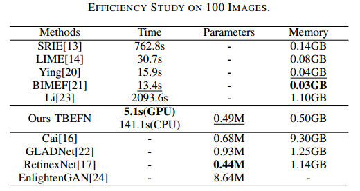

# TBEFN: A Two-branch Exposure-fusion Network for Low-light Image Enhancement


Codes for TMM20 paper ["TBEFN: A Two-branch Exposure-fusion Network for Low-light Image Enhancement"](https://ieeexplore.ieee.org/document/9261119).




### requirements
```
tensorflow==1.13.1
opencv-python
```

**Note that `tf.contrib.slim` module is used in this code, thus it could only run under tf 1.x. But we do not necessarily need to implement conv with `slim`, so with slight modification, it could run under tf 2.x **

### get started
1. file structure

|file|description|
|:-:|:-:|
|./input_dir|put your test image here|
|./results|output enhanced images|
|./ckpt|model weights (already provided, ~2MB)|
|./demo_img|used for demo|

2. how to run the code

```
cd your_path
python predict_TBEFN.py
```
### results

We provide 6 images in this demo, after running this code, you will get results as follows. (we have cropped the result so that you can have a better comparison.)



### further comparison

0. comparison with some other sota work (DEC.19)




1. PSNR/SSIM/NIQE on paired dataset




2. NIQE on six commonly used dataset




3. Efficiency



### citation

```
@ARTICLE{9261119,
  author={K. {Lu} and L. {Zhang}},
  journal={IEEE Transactions on Multimedia}, 
  title={TBEFN: A two-branch exposure-fusion network for low-light image enhancement}, 
  year={2020},
  volume={},
  number={},
  pages={1-1},
  doi={10.1109/TMM.2020.3037526}}
```

